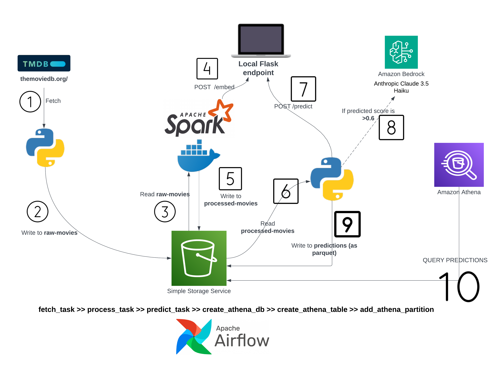
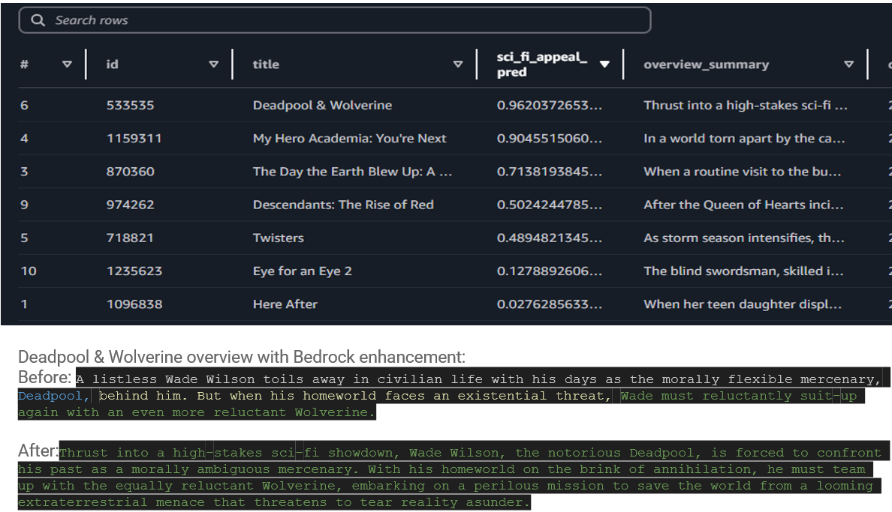

# Movie Appeal Prediction
Designed a two-phase ML pipeline using AWS (S3, Bedrock, Athena), Spark, Docker and Airflow to predict Sci-Fi genre appeal for movies, training an XGBoost model with sentence-transformers/all-MiniLM-L6-v2 embeddings and enabling inference for movies with Airflow, queryable via Athena.

## Architecture

## Results

Sample result:

